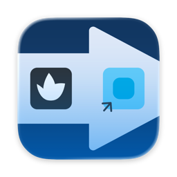
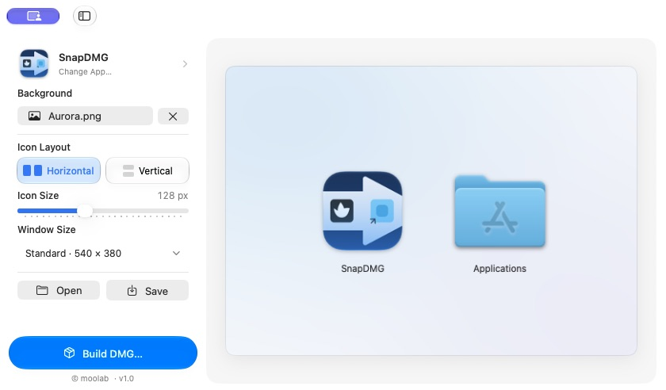

<p align="center">
  
</p>

<h1 align="center">SnapDMG</h1>

<p align="center">
  <strong>A simple way to give your Mac app a polished DMG installer.</strong>
</p>

<p align="center">
  Native macOS · SwiftUI · Apple silicon &amp; Intel · MIT License
</p>

<p align="center">
  <a href="https://github.com/MuchanKim/SnapDMG/releases">Releases</a> ·
  <a href="#quick-start">Quick start</a> ·
  <a href="#build-from-source">Build from source</a>
</p>



Pick your `.app`, add a background, and arrange the icons in a live preview. SnapDMG builds a DMG containing your app and an Applications shortcut, ready for drag-and-drop installation.

## See it in action


*Captured from the running app: resize icons, switch layouts, drag each icon into place, and expand the preview.*

## Features

| Feature | What it does |
| --- | --- |
| **Visual layout editor** | Start with a horizontal or vertical layout, then drag the app and Applications icons to fine-tune their positions. |
| **Custom backgrounds** | Choose a PNG or JPEG and preview its crop before building. |
| **Size controls** | Adjust icon size and choose a preset or custom installer window size. |
| **Reusable projects** | Save your layout as a `.snapdmg` project and open it again for the next release. |
| **In-app updates** | Check for new versions from the app menu, powered by Sparkle. |

## Download

**Requires macOS 26 or later.** Release builds support Apple silicon and Intel Macs.

Check [GitHub Releases](https://github.com/MuchanKim/SnapDMG/releases) for prebuilt downloads. The first binary release is being prepared; you can [build from source](#build-from-source) in the meantime.

To install a released build, unzip `SnapDMG-<version>.zip` and move `SnapDMG.app` to your Applications folder. Use **SnapDMG → Check for Updates…** to check for a newer version.

## Quick start

1. Drop an `.app` into the preview, or click **Select App…**.
2. Optionally choose a PNG or JPEG with **Choose Image…**.
3. Pick **Horizontal** or **Vertical**, adjust sizes, and drag the icons to refine the layout.
4. Click **Build DMG…** and choose where to save the installer.

Use **Save** to keep a `.snapdmg` project for later. When reopening a project, select the app again; keep its background image available at the saved path.

## Build from source

Use Xcode with the macOS 26 SDK or later.

1. Clone this repository and open `SnapDMG/SnapDMG.xcodeproj`.
2. Let Swift Package Manager resolve the Sparkle dependency.
3. Select the **SnapDMG** scheme and **My Mac** destination.
4. Choose your own development team in **Signing & Capabilities**, then run the app.

Run the unit tests from the repository root:

```sh
xcodebuild -project SnapDMG/SnapDMG.xcodeproj \
  -scheme SnapDMG -destination 'platform=macOS' \
  -only-testing:SnapDMGTests test
```

For Developer ID signing, notarization, and Sparkle update feeds, see the [release guide](docs/updates.md) (Korean).

## License

SnapDMG is available under the [MIT License](LICENSE).

Sparkle's third-party license notices are included in the app and in [Sparkle-LICENSE.txt](SnapDMG/SnapDMG/Sparkle-LICENSE.txt).
